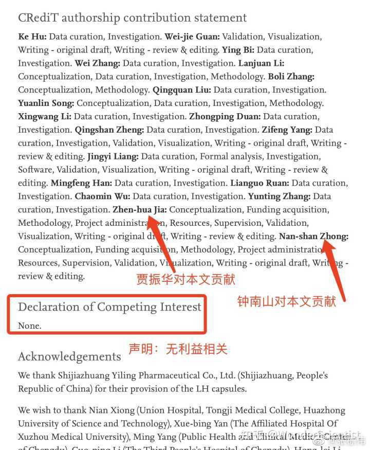
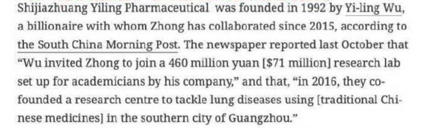

## 如何看待王思聪微博账号被禁言，可能是因为什么？
4月19日，王思聪 的微博显示“因违反相关法律法规，该用户目前处于禁言状态”。

### 答主：一言难尽
昨天饶毅也怼了莲花清瘟，以岭药业也做出了回应。我先不着急站队，我只想问一件事儿，问一件不符合逻辑的事儿:

“为何从2020年3月起，只要有防疫需求的城市，都充斥着莲花清瘟?”这个产量之巨大，收益之广泛，理由到底是什么？特效药？！”

我先提出问题，再提出跟问题的相关因子:

1.2020年1月起莲花清瘟进入大众视线，以岭药业承认莲花清瘟没有经过任何双盲实验，以岭药业原话:

```
    由于2020年初疫情暴发的紧迫性且患者需要及时治疗，没有进行双盲试验，即研究者和受试者都知道真实的给药情况。此外出于人道考虑，研究也没有设置安慰剂对照试验。后续连花清瘟会进行双盲、前瞻性的随机对照试验，以全面评估连花清瘟胶囊在更大的患者群体中的疗效。
```

2.2020年4月，国家药品监督管理局批准连花清瘟胶囊/颗粒在原批准适应症的基础上，增加“新型冠状病毒肺炎轻型、普通型”的新适应症。

3.2020年5月，引用了发表在《植物医学》(Phytomedicine)上的《中药连花清瘟胶囊治疗新型冠状病毒肺炎前瞻性、随机、对照、多中心临床研究》的相关研究成果(报告第8页)。该研究由全国23家新冠肺炎定点收治医院共同参与，共纳入284例临床病例，随机分为对照组142例(常规治疗)和治疗组142例(常规治疗加用连花清瘟胶囊/颗粒，胶囊4粒/次，颗粒1袋，3次/日)，疗程14天。研究结果显示，连花清瘟治疗组的主要临床症状(发热、乏力、咳嗽等) 改善率较对照组显著提高，症状持续时间明显缩短，临床治愈率有效提升。

4.　以岭药业：关于连花清瘟治疗新冠肺炎作用论文作者共有19人 ，该项目由钟南山院士全面主持，临床观察部分由其独立主持完成，贾振华教授因参与该项目设计而列为作者之一并没参与临床观察及数据处理，该论文发表已向出版社说明。以岭药业向该研究提供部分资金及研究药物等事宜均已由《Phytomedicine》编辑部进行了澄清并予以公开可查阅，发表于2021年第93期。

(贾振华，男，主任医师、教授，博士生导师，河北医科大学附属以岭医院院长兼心血管病科主任，中华中医药学会络病分会副主任委员兼秘书长、中国中西医结合学会血管脉络病专委会秘书长、世界中医药学会络病专委会副会长兼秘书长、河北省中西医结合学会副会长。以岭药业董事长吴以岭女婿。)

论文我也看了一下:



嗯，是你构思的，钱是你给的，监管却也是你做的，还负责校正，项目管理。最后，你说只参与了项目设计，好吧，我信，也不说涉及学术造假这么点小事儿了，反正你们说的我都信。

当然，钟老我肯定还是信任的，医神嘛，毕竟吴以岭在2016年邀请钟老参与4.6亿人民币的实验室建设的时候，钟老完全是出于对科学的热爱和探索：



5.以岭药业表示莲花对转阴的相关性没有显著性差异，对症状减轻的相关性有统计意义。

以上的相关因子不是我说的，均由以岭药业昨天自己提的，他们试图证明莲花清瘟的有效性。

写到这儿，我反而不太关心莲花清瘟的有效性了，这药有没有效不是重点了。我只觉得智商被侮辱了:

1.第一，提问，一个在2020年整年，双盲实验都没有做，抽样比例只有142/284例的药物，如何能够迅速成为治疗预防新冠的掌上明珠？原因？到现在上海每家每户都能拿到。

**以岭药业到现在自己都不能确定对新冠的疗效，何况是两年前，全渠道都是莲花清瘟？**

这才是问题，不需要懂医学，有起码的逻辑能力，连小学生都明白对一件完全不了解的事物承保守态度。14亿？

2.我今天不谈西药，只谈中药和莲花清瘟，做一个假设，假设中药对新冠治疗完全有效，那么对应中药治疗类似病症的药这么多，网上能搜的品牌就好几千，为什么全国上下只认一个自己都没法证实有效的莲花清瘟？

更尴尬的是在新冠爆发的三年里都没有一个医学专家敢出来问一下。依然是小学生逻辑。

3.一提莲花清瘟就拿辉瑞说事儿，从逻辑来说二者没有任何联系，根本就是两码事。质疑辉瑞和质疑莲花清瘟没有任何联系，还是小学生都懂的逻辑。

作者：一言难尽<br>
链接：[知乎](https://www.zhihu.com/question/528873920/answer/2447813660)<br>
来源：知乎<br>
著作权归作者所有。<br>

[back to menu](../)
