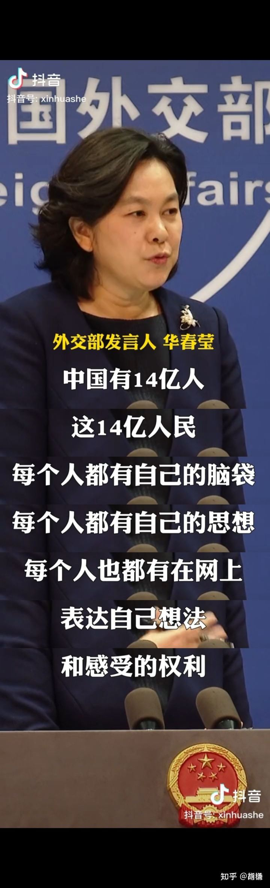

## 如何看待王思聪微博账号被禁言，可能是因为什么？
4月19日，王思聪 的微博显示“因违反相关法律法规，该用户目前处于禁言状态”。

### 答主：一言难尽
昨天饶毅也怼了莲花清瘟，以岭药业也做出了回应。我先不着急站队，我只想问一件事儿，问一件不符合逻辑的事儿:

“为何从2020年3月起，只要有防疫需求的城市，都充斥着莲花清瘟?”这个产量之巨大，收益之广泛，理由到底是什么？特效药？！”

我先提出问题，再提出跟问题的相关因子:

1.2020年1月起莲花清瘟进入大众视线，以岭药业承认莲花清瘟没有经过任何双盲实验，以岭药业原话:

> 由于2020年初疫情暴发的紧迫性且患者需要及时治疗，没有进行双盲试验，即研究者和受试者都知道真实的给药情况。此外出于人道考虑，研究也没有设置安慰剂对照试验。后续连花清瘟会进行双盲、前瞻性的随机对照试验，以全面评估连花清瘟胶囊在更大的患者群体中的疗效。

2.2020年4月，国家药品监督管理局批准连花清瘟胶囊/颗粒在原批准适应症的基础上，增加“新型冠状病毒肺炎轻型、普通型”的新适应症。

3.2020年5月，引用了发表在《植物医学》(Phytomedicine)上的《中药连花清瘟胶囊治疗新型冠状病毒肺炎前瞻性、随机、对照、多中心临床研究》的相关研究成果(报告第8页)。该研究由全国23家新冠肺炎定点收治医院共同参与，共纳入284例临床病例，随机分为对照组142例(常规治疗)和治疗组142例(常规治疗加用连花清瘟胶囊/颗粒，胶囊4粒/次，颗粒1袋，3次/日)，疗程14天。研究结果显示，连花清瘟治疗组的主要临床症状(发热、乏力、咳嗽等) 改善率较对照组显著提高，症状持续时间明显缩短，临床治愈率有效提升。

4.　以岭药业：关于连花清瘟治疗新冠肺炎作用论文作者共有19人 ，该项目由钟南山院士全面主持，临床观察部分由其独立主持完成，贾振华教授因参与该项目设计而列为作者之一并没参与临床观察及数据处理，该论文发表已向出版社说明。以岭药业向该研究提供部分资金及研究药物等事宜均已由《Phytomedicine》编辑部进行了澄清并予以公开可查阅，发表于2021年第93期。

(贾振华，男，主任医师、教授，博士生导师，河北医科大学附属以岭医院院长兼心血管病科主任，中华中医药学会络病分会副主任委员兼秘书长、中国中西医结合学会血管脉络病专委会秘书长、世界中医药学会络病专委会副会长兼秘书长、河北省中西医结合学会副会长。以岭药业董事长吴以岭女婿。)

论文我也看了一下:

嗯，是你构思的，钱是你给的，监管却也是你做的，还负责校正，项目管理。最后，你说只参与了项目设计，好吧，我信，也不说涉及学术造假这么点小事儿了，反正你们说的我都信。

当然，钟老我肯定还是信任的，医神嘛，毕竟吴以岭在2016年邀请钟老参与4.6亿人民币的实验室建设的时候，钟老完全是出于对科学的热爱和探索：

5.以岭药业表示莲花对转阴的相关性没有显著性差异，对症状减轻的相关性有统计意义。

以上的相关因子不是我说的，均由以岭药业昨天自己提的，他们试图证明莲花清瘟的有效性。

写到这儿，我反而不太关心莲花清瘟的有效性了，这药有没有效不是重点了。我只觉得智商被侮辱了:

1.第一，提问，一个在2020年整年，双盲实验都没有做，抽样比例只有142/284例的药物，如何能够迅速成为治疗预防新冠的掌上明珠？原因？到现在上海每家每户都能拿到。

**以岭药业到现在自己都不能确定对新冠的疗效，何况是两年前，全渠道都是莲花清瘟？**

这才是问题，不需要懂医学，有起码的逻辑能力，连小学生都明白对一件完全不了解的事物承保守态度。14亿？

2.我今天不谈西药，只谈中药和莲花清瘟，做一个假设，假设中药对新冠治疗完全有效，那么对应中药治疗类似病症的药这么多，网上能搜的品牌就好几千，为什么全国上下只认一个自己都没法证实有效的莲花清瘟？

更尴尬的是在新冠爆发的三年里都没有一个医学专家敢出来问一下。依然是小学生逻辑。

3.一提莲花清瘟就拿辉瑞说事儿，从逻辑来说二者没有任何联系，根本就是两码事。质疑辉瑞和质疑莲花清瘟没有任何联系，还是小学生都懂的逻辑。

作者：一言难尽 
链接：[知乎](https://www.zhihu.com/question/528873920/answer/2447813660) 
来源：知乎 
著作权归作者所有。 

[back to menu](../)

## 答主：奶包的大叔

在上海封城前，2022年3月17日晚，国内媒体官宣报道了一个好消息：2.12万盒进口辉瑞新冠口服药Paxlovid运抵上海，办完手续后，将运往全国抗疫一线。

当时，国家应急防控药物工程技术研究中心研究员（钟武）还特别强调：

>“疫情防控全链条中极为重要的一块，就是具有像Paxlovid、Molnupiravir等可口服的小分子抗新冠病毒药物。第一，它可以用于居家口服治疗用；第二，它很容易获得，经济性和可及性好。使用这种药品有2个显著作用，一是如果能够快速把体内新冠病毒清除掉，将减少甚至避免严重并发症；二是在病毒清除之后，即使有并发症也可以按照常规住院处理即可，不需要特别的负压隔离病房。因此特效药可能有助于极大缓解对医疗资源的挤占。”

显然，在上海封城前11天运抵上海的2.12万盒辉瑞Paxlovid，原本应该可以避免后来发生的许多人间杯具。

然并卵。

一个月之后（4月17日），上海官宣的重症患者为16例，其中只有一名33岁的青年，其余15名均为70岁以上的老年人。

没人知道，这批辉瑞Paxlovid中究竟有多少使用在了上海这16例重症患者，以及其他数量可能更多、在官宣通报中“不存在”的实际重症患者身上？

4月18日，上海官宣的新增死亡病例已经从之前“一直保持”的零、变成了7例（年龄从60岁到101岁）。

到了4月19日，因为连花清瘟事件而登上热搜榜的王思聪最终被新浪微博禁言。

这时，上面所提到的问题，基本上已经不用再问了。

⚠️针对评论区的一点update：

2022年3月29日，在封城的第二天，上海相关部门就发布了《上海市全力抗疫情助企业促发展的若干政策措施》，其中明确提到“支持新冠病毒疫苗和治疗药物进口”。

而在此一年前（2021年4月），复星医药与BoiNTech在进博会期间签订了合资建厂的项目意向书。当时，BoiNTech公司CEO（Uğur Şahin）表示，复必泰最迟在2021年7月获批上市，但前提是BoiNTech要将1亿支复必泰完成交货；而BoiNTech对复星医药进行技术转移（通过成立合资公司）的前提则是复必泰获批上市。

事实上，在此1个半月之前（2021年2月27日），首批68.5万剂“复必泰”疫苗就从德国法兰克福机场运抵香港；其中58.5万剂供应香港、10万剂供应澳门。

截至2022年3月，复必泰已在港澳台地区累计接种2500万剂。但复必泰在大陆的情况，却依然是一个谜。

没人知道（敢问），身在锅内却能够使用辉瑞-BoiNTech疫苗的人，究竟是什么样的level阶层。

2022年3 月 9 日晚间，中国医药集团发布公告称，公司已与美国辉瑞签订协议，将在协议期内（2022年度）负责辉瑞公司新冠病毒口服治疗药物Paxlovid在中国大陆市场的商业运营。

然鹅，对于 Paxlovid 在国内市场的价格究竟是多少，中国医药却只字未提。 

目前，在高收入国家（以美国为例），默沙东Molnupiravir向美国政府的单疗程(5天)销售价格为 712美元，辉瑞Paxlovid在美国的单疗程定价则为530美元。

同时，辉瑞公司还表示今年将向中低等收入国家提供约1000万疗程的Paxlovid，并将在低收入国家降低该药的价格。

根据印度 Dr. Reddy’s Laboratories., Ltd公司的官宣显示，该公司生产的Molnupiravir仿制药(Molflu)定价为每粒 35 卢比（约0.47 美元），患者的单疗程（在5天的疗程中服用40粒仿制药）的总费用为1400卢比（约18.77美元）。

这个价格，不仅已经直逼默沙东Molnupiravir的生产成本（17.74美元\u002F单疗程），而且还比Molnupiravir在美国的定价（712美元）降价超过了97%。

那么，在默沙东 Molnupiravir 价格为辉瑞Paxlovid价格1.3 倍的情况下，国内市场上的辉瑞Paxlovid单疗程一盒Paxlovid 有30片片剂，包括20粒奈玛特韦片+10 粒 利托那韦片。价格又会是多少呢?

由于在理论上，仿制药的售价会大大低于原研药，因此国内业界和市场（尤其是资本市场）普遍预测，在未来广泛供应后，新冠小分子仿制药平均价格约为13.14美元。

对此，复星医药、华海药业也在公告中表示，本次许可产品价格为实际成本+协商后的合理加价。专利许可使用费则根据购买方性质的不同，两家公司均应按照年度净销售 额(定义依据协议)的5%或 10%向辉瑞支付专利许可使用费。

但此专利许可使用费 将自WHO宣布新冠肺炎疫情不再被列为“国际关注的突发公共卫生事件”的次月起 开始收取，并且对于在低收入国家的销售，将豁免向辉瑞支付专利许可使用费。

也就是说，国内市场上的辉瑞Paxlovid单疗程价格，市场普遍的心理预期都在25~30美元一盒。

然鹅，直到3月27日，浙江电视台报导了辉瑞口服药Paxlovid开始在浙江投入使用、价格为2300元\u002F盒之后，这个秘密才最终被揭晓。

这个价格，不仅已经超过了市场预期的10倍，而且还是印度仿制药的19倍。 

而在此6天前（3月21日），国家医保局办公室就印发了《关于切实做好当前疫情防控医疗保障工作的通知》

> 各省级医保部门要参照相关要求，对新增的奈玛特韦片 利托那韦片，由医疗机构按照企业与有关部门沟通一致的价格采购，医保部门按规定做好支付。 

于是，医保的money究竟从何而来、又最终流向了哪里，就变成了一个极其深邃的哲学问题。

显然，如果说早已进入医保目录的连花清瘟在2020年高达42亿元的销售额，最大的受益方是以岭药业；那么，辉瑞Paxlovid在国内2300元一盒的垄断性价格，最大的收益方则是其国内唯一总代理：中国医药集团。

至于2300元一盒的价格中，究竟【此处删除42字】，则是一个无人敢问的送命题。

事实上，在本轮Omicron疫情中，亚洲地区疫情最严重的其实是韩国。

当上海的单日新增确诊人数刚刚突破2万人大关时，韩国的单日新增确诊人数就早已突破了5万人（甚至一度高达10万人）。根据WHO的官宣通报显示，从3月初开始，韩国的单日新增确诊数量连续3周在全球排名第一。

而在上海封城的前几天，韩国的确诊总病例数就已破千万大关、占韩国总人口比例高达20%。

那么问题来了，为什么疫情更加严重的韩国，反而没有发生像上海这样的封城和次生灾害杯具呢？

2022年1月14日，韩国一名74岁、有10年糖尿病史、4年前还曾接受过前列腺肿瘤手术的新冠“高风险”确诊患者，成为了该国首例获得辉瑞Paxlovid、并在用药2天以后病情明显减轻的成功病例。

该患者（确诊前已完成“加强针”接种）14日在大田市一家综合医院拿到Paxlovid处方，晚上8点左右第一次服用，16日中午症状消失。

随后，韩国政府宣布，从当天起就可以每日向1000多名新冠确诊患者提供Paxlovid口服药，首批可供2.1万人使用；主要用于出现症状不超过5日、病情可能从轻症向中症恶化的病例，并优先用于65岁以上、免疫力低下但正在居家治疗、或在定点隔离治疗设施接受治疗的病例。

实际上，辉瑞Paxlovid并不仅仅只是针对重症患者，反而更应该让轻度和中度确诊患者使用。用特区政府专家顾问、香港中文大学呼吸系统科教授许树昌的话说则是：

> 轻症患者能越早服用新冠特效口服药，效果就越显著。如果检测到阳性再经医生问诊，在5天内服药、甚至头3日服药，成效会更好；但如果迟于5日，则效用大减。

然鹅，自从3月初本轮Omicron疫情爆发以来，上海累计确诊人数已超过20万人, 上海此轮疫情从发生到确诊人数突破10万例，用了超过1个月的时间；而从10万例增长至20万例，仅用了不到5天时间。但运抵上海的辉瑞Paxlovid数量(全国各地的总量，并不只是上海本地的用量)，却还不足确诊人数的十分之一。

2022年3月24日，新加坡政府宣布，将从4月1日起向已接种疫苗的游客全面开放边境。随后，边境已经关闭2年多的韩国政府也宣布，从4月1日起开放边境，已接种疫苗的游客将被允许进入韩国。

于是，就形成了确诊人数远远高于国内的韩国反而提前开放国境，而国内却还依然处于“一人阳性、全区隔离”的鲜明（尴尬）对比。

由此，就产生了另一个更加深邃的的哲学问题：为什么国内紧急批准引进的辉瑞Paxlovid，却对上海这轮疫情几乎毫无作用？

2021年12月22日，美国政府宣布已获取了1000万人份的（辉瑞）Paxlovid、以及310万人份的（默沙东）Molnupiravir。英国政府也宣布，已订购223万人份的Molnupiravir、275万人份的Paxlovid。

在亚洲，日本政府宣布，已获取了160万人份的Molnupiravir、并追加订购了200万人份的Paxlovid。而韩国政府当时仅仅只订购了7万人份的Paxlovid、24.2万人份的Molnupiravir。

当时，《朝鲜日报》还对此发出了赤果果的批评：“在新冠疫苗的引进过程中，韩国政府就已经因为行动迟缓而吃尽了苦头，此次恐将又一次重蹈覆辙。”

韩国天主教大学医学院微生物学名誉教授朴顺英也表示：“现在的关键，是尽快进口辉瑞的特效药Paxlovid，7万人份简直少得可怜。”

很快，在随后的2周时间内，韩国政府就进行了紧急增购。截至2022年1月5日，韩国政府宣布，已成功实现了确保100.4万人份的新冠口服特效药，包括76.2万人份的Paxlovid、24.2万人份的Molnupiravir。　

也就是说，日本、韩国政府目前已提前确保的新冠口服特效药规模，已经分别相当于国内的180倍、50倍。

于是，一个最耐人寻味的终极问题也油然而生：新冠口服特效药的费用，究竟由谁来买单？

2021年9月，韩国政府表示，将全额承担新冠确诊患者的进口新冠口服药物的费用，人均药费将超过90万韩元（约合4900元RMB）。韩国中央应急处置本部社会战略组长（孙映莱）表示，救治新冠患者的费用目前由政府全额报销。当时，韩国用于治疗新冠患者的瑞德西韦药费由韩国政府全额报销。个人不需要承担任何费用，今后引进口服药时也将适用同样的原则。

根据韩国疾病管理厅发布的数据显示，韩国政府2021年用于购买口服新冠药物的补充预算为168亿韩元，2022年其预算规模约为194亿韩元。

也就是说，这362亿韩元都是由韩国政府承担，而与“国民健康保险”（韩国的医保）完全无关。

果然，没有对比就没有伤害。

由于涉及sensitive内容，【此处删除1307字】

丰田章男在清华演讲时说，埃尔法卖给中国经销商时，一分钱都没有加价。

楼下保安则说，当我看到云南省财政厅4月12日紧急拨付用来援助上海疫情的6600万元中高达4000万元都是用来采购中成药的时候，我就意识到上海一时半会是无法解封了。

⚠️以上内容节选自《腐败眷属的欢愉》，所有sensitive内容均已删除。

作者：奶包的大叔 
链接：[知乎](https://www.zhihu.com/question/528873920/answer/2447622712) 
来源：知乎 
著作权归作者所有。 

