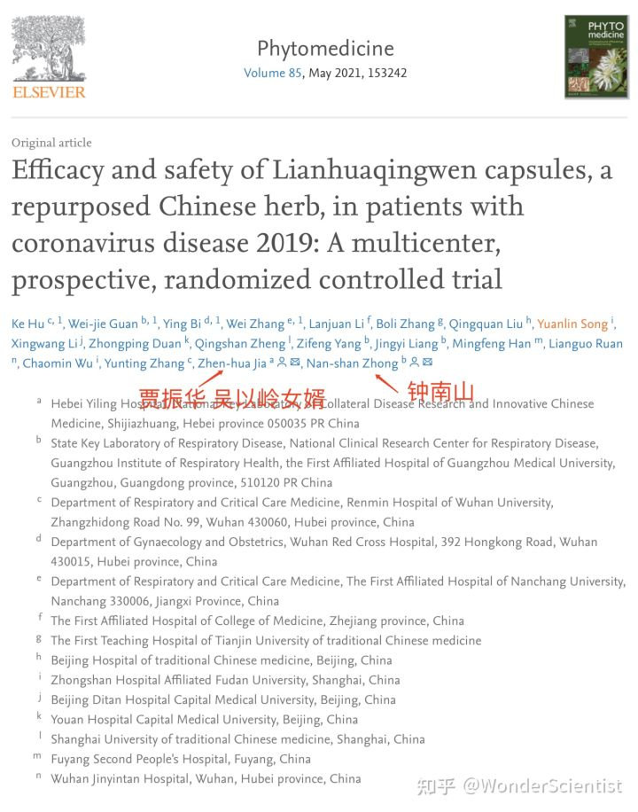
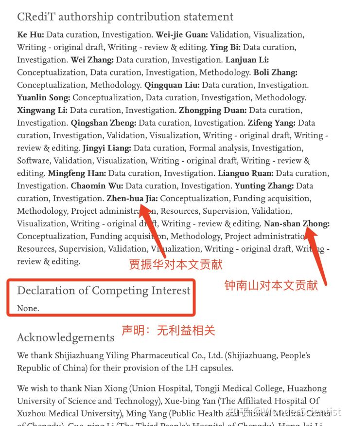
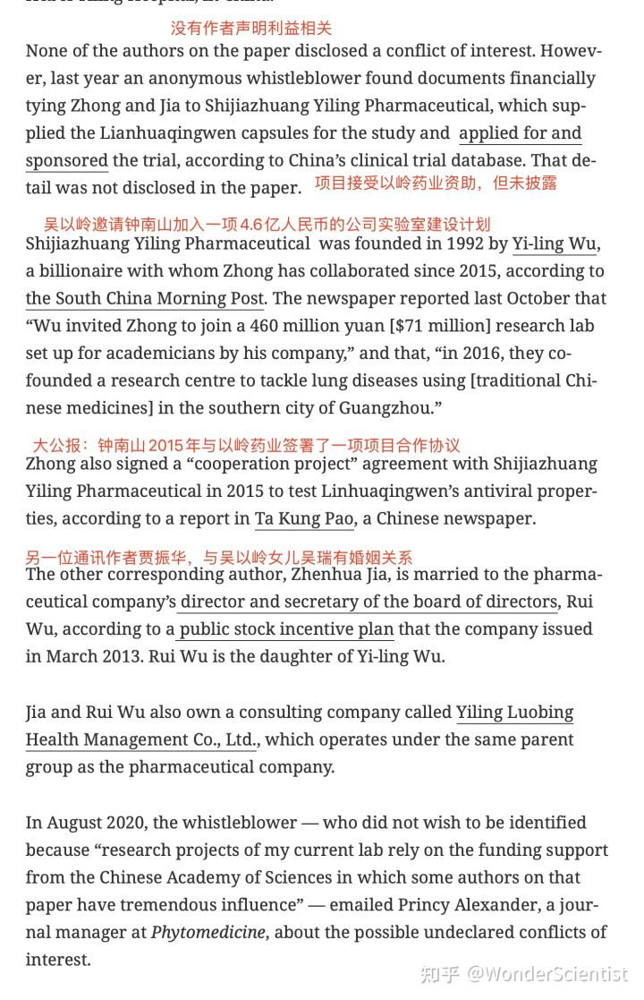
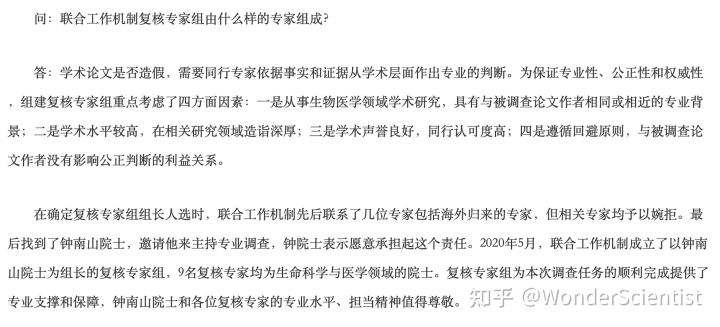
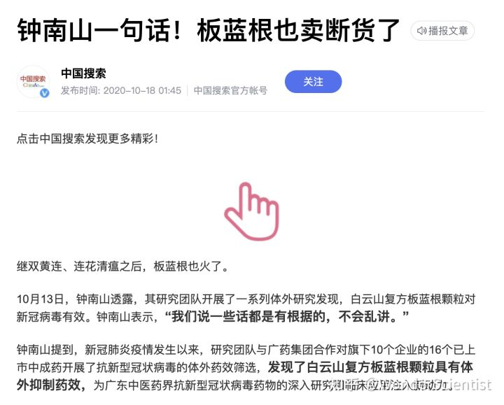
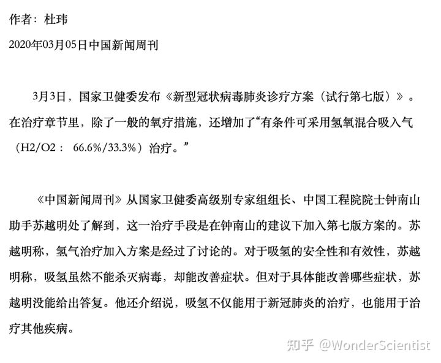
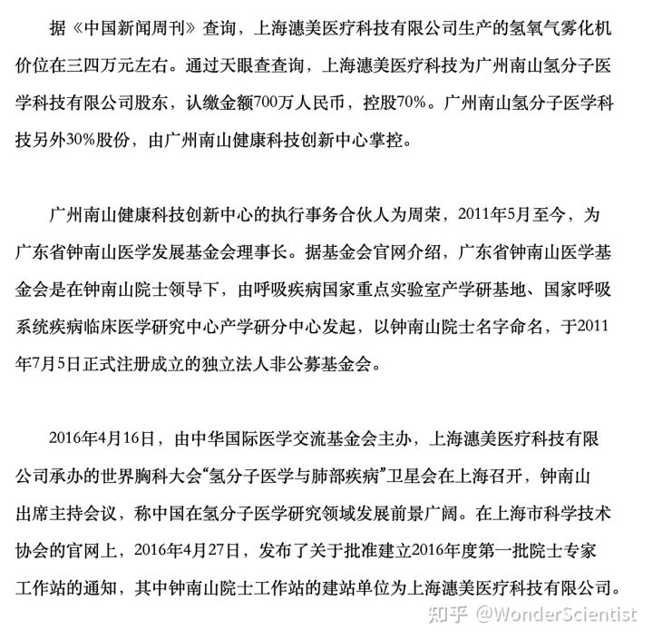

## 如何评价钟南山推荐连花清瘟胶囊？

### 答主：WonderScientist
钟老先生是出了名的“好用”啊……

钟老先生和吴以岭女婿贾振华作为共同通讯作者发表的[关于连花清瘟的论文](https://www.sciencedirect.com/science/article/pii/S0944711320300738)，是目前连花清瘟治疗新冠最重要的文献之一，据说也是前段时间向世卫组织推荐的两项连花清瘟研究之一。

著名学术不端现象报道网站撤稿观察http://RetractionWatch.com对于该论文的[报道](https://retractionwatch.com/2021/05/04/prominent-chinese-scientist-failed-to-disclose-company-ties-in-clinical-trial-paper/)：

钟老先生还是“图片误用”调查组[组长](https://www.shupl.edu.cn/xbbjb/2021/0203/c2261a86533/page.htm)：

去年钟老先生还在新闻发布会上说广州白云山药业的板蓝根在体外实验中对新冠病毒有抑制作用，白云山市值暴涨50亿。钟老先生发布会上原话说：“复方板蓝根对新冠病毒有效。这个东西啊，我们说一句话，都有根据的，不会乱讲。在这一方面啊，白云山的质量是完全相信的。这么多年的观察啊，老百姓的反应啊，是有效的。都有很好的预防病毒进入细胞的作用，有这个抗炎的作用，这些都是非常肯定的。”

发布会现场视频地址在此：[link](https://link.zhihu.com/?target=http%3A//vd3.bdstatic.com/mda-kjh2gfy3g5z2d9dc/mda-kjh2gfy3g5z2d9dc.mp4%3Fplaylist%3D%255B%2522hd%2522%252C%2522sc%2522%255D)

去年3月，在钟老先生建议下，新冠肺炎第七版诊疗方案中加入了氢氧混合吸入疗法。

看到有其它答主说钟老先生要么是相信中医，要么是政治需要，我只能说我自己有不同的判断。

作者：WonderScientist 
链接：[知乎](https://www.zhihu.com/question/528270625/answer/2444868054) 
来源：知乎 
著作权归作者所有。 

[back to menu](../)
